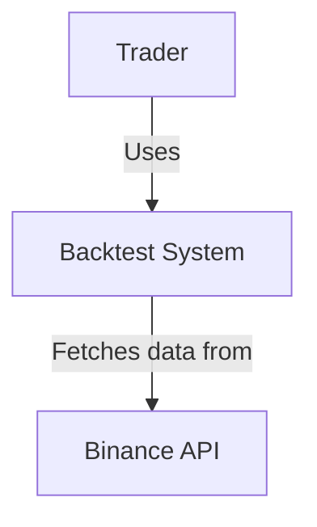
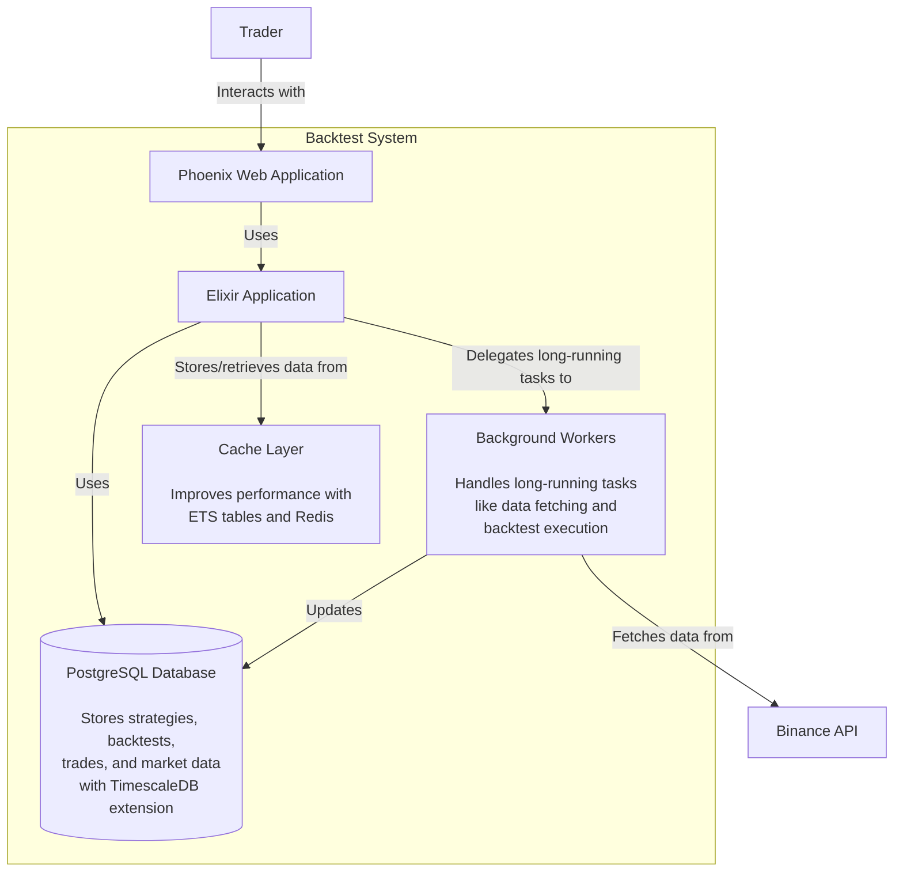
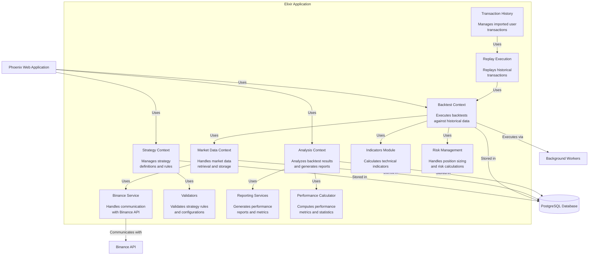
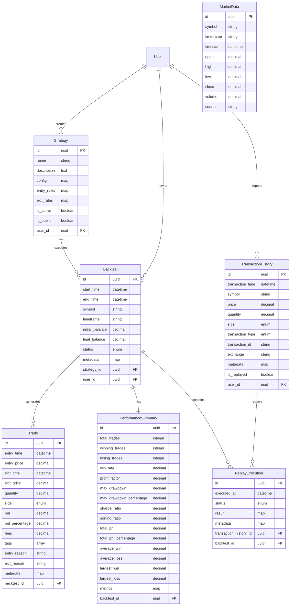
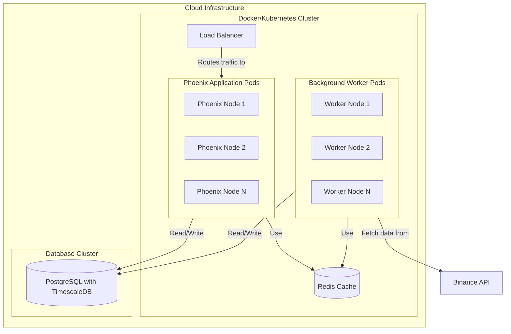
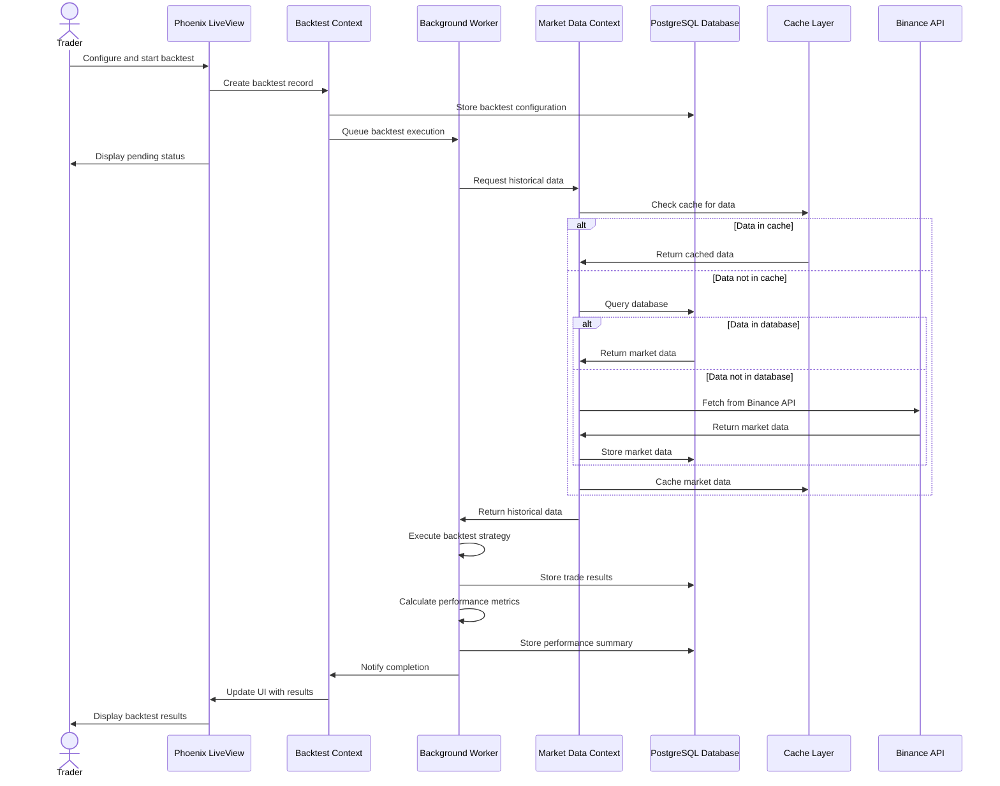
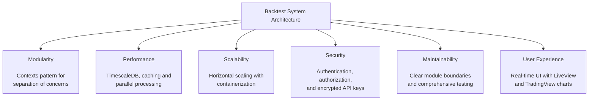
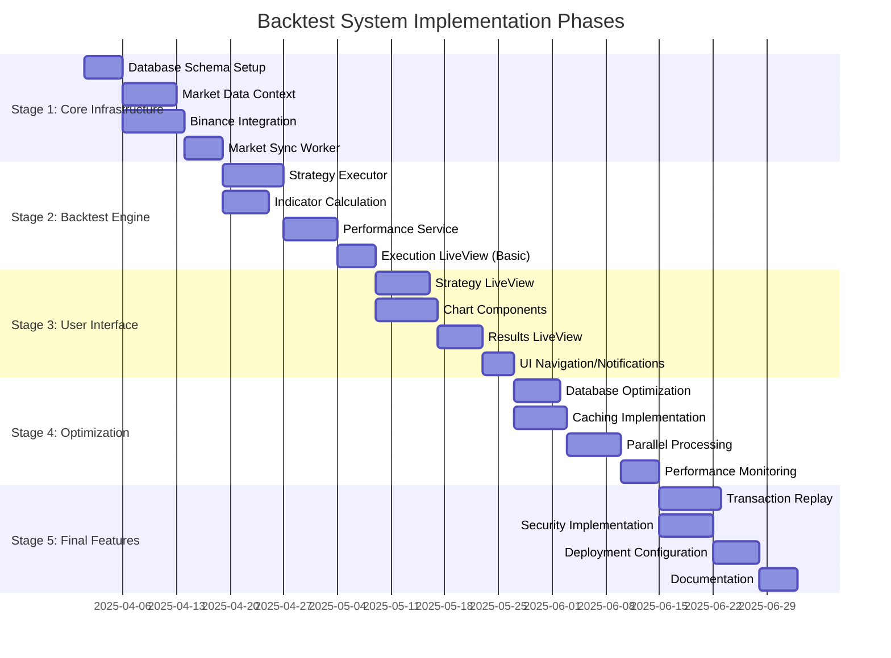
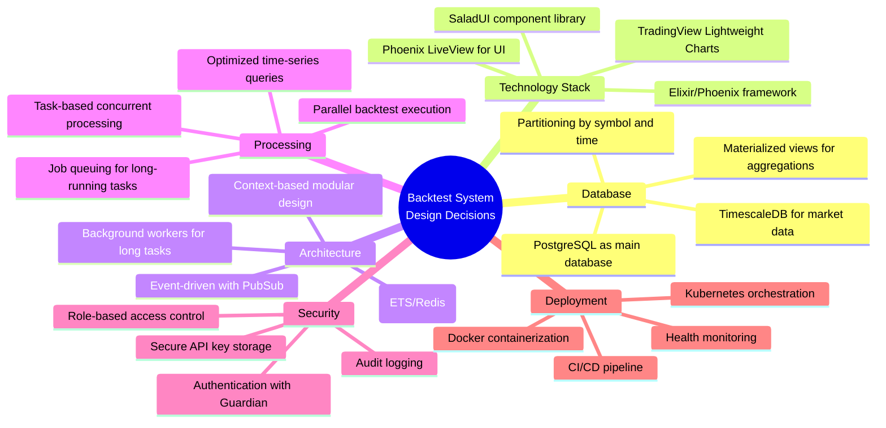

# Backtest System C4 Model Architecture

This document presents a comprehensive C4 model for the Backtest System, visualizing its architecture across different levels of abstraction.

## 1. Level 1: System Context Diagram

The System Context diagram shows the Backtest System in relation to its users and external dependencies.

## 2. Level 2: Container Diagram

The Container diagram shows the high-level technical building blocks that make up the Backtest System.

## 3. Level 3: Component Diagram

The Component diagram shows the key components inside the Elixir Application container.

## 4. Code Level Diagram: Database Schema Relationships

This diagram shows the key database schema relationships in the system.

## 5. Deployment Diagram

The Deployment diagram shows the runtime infrastructure for the Backtest System.

## 6. Dynamic View: Backtest Execution Flow

This diagram shows the sequence of operations during a backtest execution.

## 7. Key Architectural Characteristics

## 8. Implementation Phases

This diagram shows the planned implementation stages for the Backtest System.

## 9. Key Design Decisions

This diagram highlights the key design decisions that underpin the Backtest System.

## 10. Summary

The C4 model provides multiple perspectives on the Backtest System architecture, from high-level context through containers and components down to code-level relationships. This hierarchical approach helps stakeholders understand the system at the appropriate level of detail for their needs.

Key architectural features include:

1. **Modular Design**: Using Phoenix's context pattern for clean separation of concerns
2. **Time-Series Optimization**: Leveraging TimescaleDB for efficient market data storage and retrieval
3. **Real-Time UI**: Phoenix LiveView for a responsive, reactive user experience
4. **Parallel Processing**: Background workers for handling computation-intensive tasks
5. **Multi-Level Caching**: ETS tables and Redis for optimized performance
6. **Security Focus**: Proper authentication, authorization, and secure API key management
7. **Scalable Infrastructure**: Docker/Kubernetes configuration for horizontal scaling 