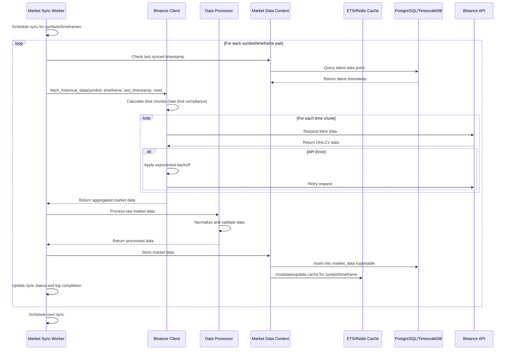
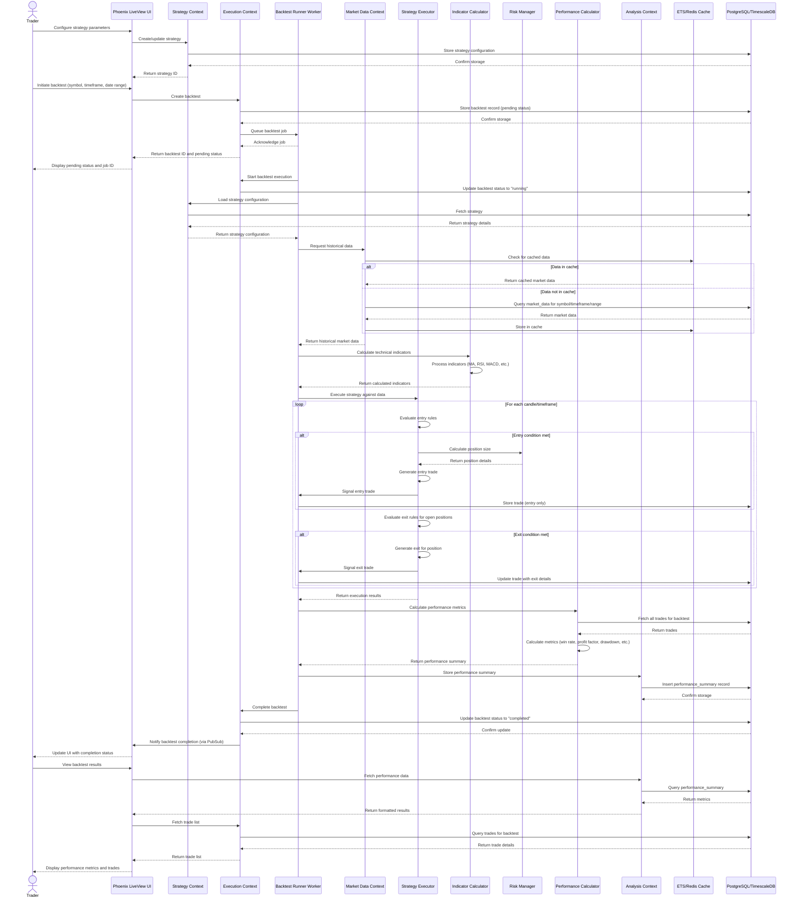
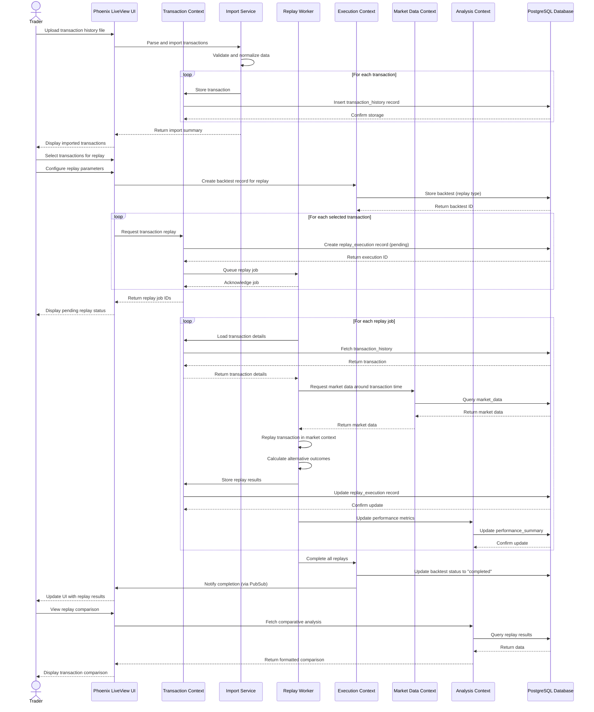
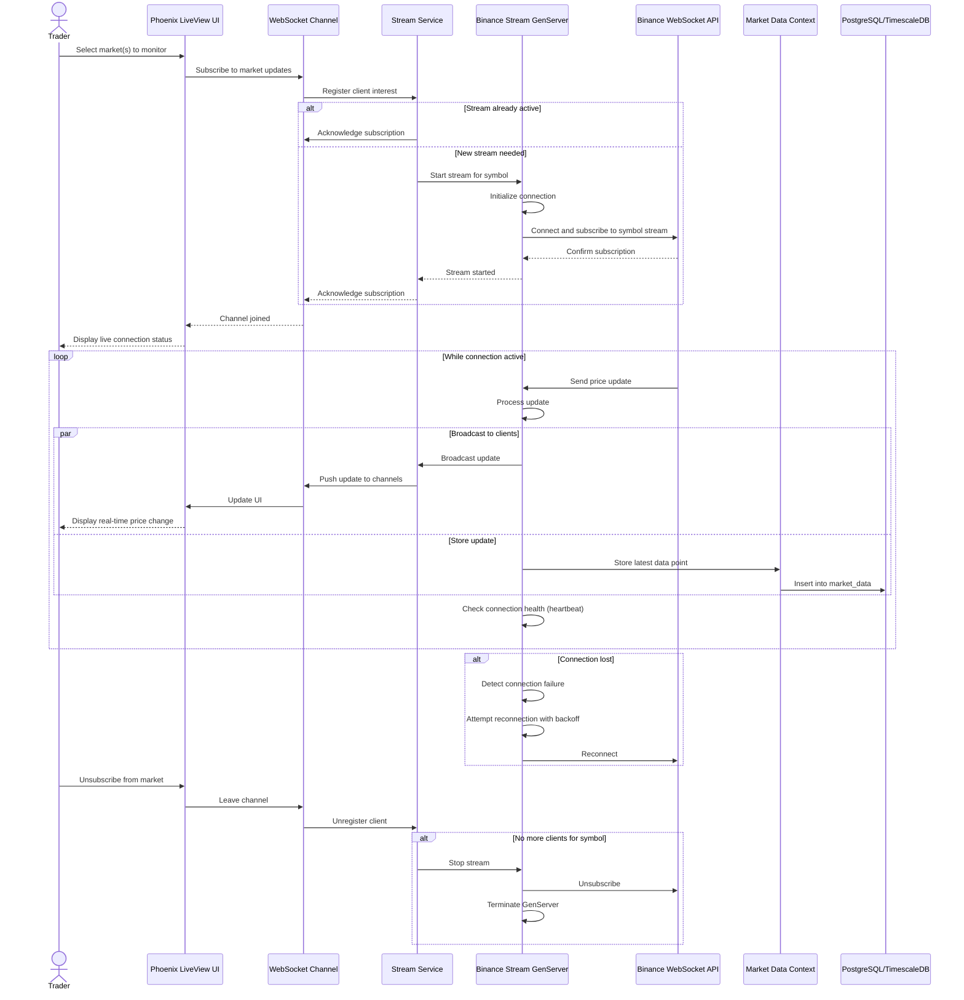
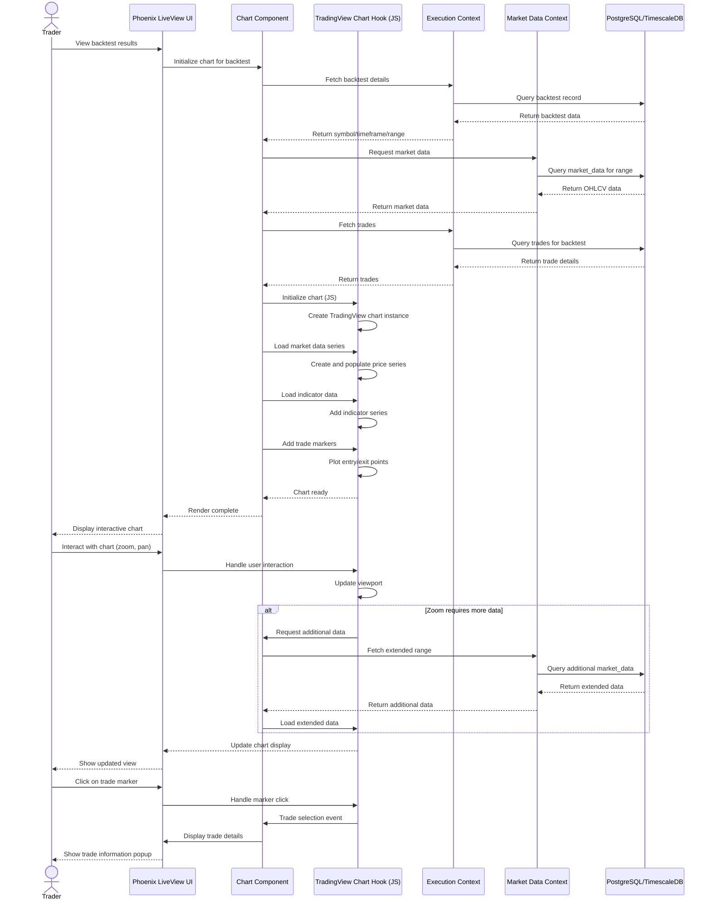

# Backtest System - Comprehensive Sequence Diagrams

This document presents detailed sequence diagrams for the key processes in the Backtest System.

## 1. Market Data Synchronization Flow

This diagram illustrates how historical market data is fetched, processed, and stored in the system.

## 2. Complete Backtest Execution Flow

This diagram shows the detailed flow of a backtest execution, from strategy configuration to results analysis.

## 3. Transaction Replay Flow

This diagram shows how historical transactions are imported and replayed in the system.

## 4. Real-time Market Data Streaming Flow

This diagram illustrates how the system can stream real-time market data for live testing.

## 5. Chart and Trade Visualization Flow

This diagram shows how the system visualizes backtested trades on interactive charts.

These detailed sequence diagrams illustrate the key processes and interactions in the Backtest System, providing a comprehensive view of how the different components work together to deliver the system's functionality. 