# Backtest System Diagrams

This document presents visual representations of the backtest system architecture and implementation stages using mermaid diagrams.

## 1. High-Level System Architecture

This diagram shows the overall system architecture with its main layers.

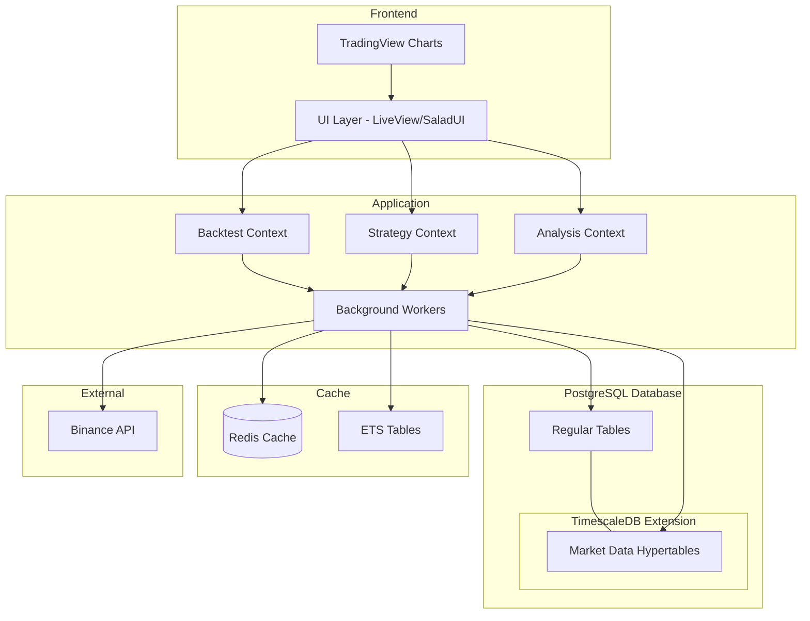

## 2. Database Schema Relationships

This diagram shows the relationships between the primary database schemas in the system.

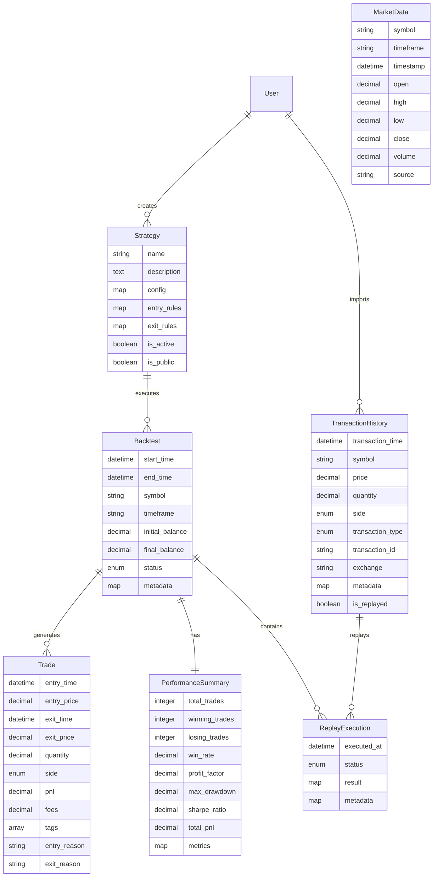

## 3. Folder Structure

This diagram represents the core folder structure of the backtest system.

```mermaid
graph TD
    root[lib/]
    central[central/]
    central_web[central_web/]
    backtest[backtest/]
    market_data[market_data/]
    contexts[contexts/]
    schemas[schemas/]
    services[services/]
    validators[validators/]
    indicators[indicators/]
    risk_management[risk_management/]
    reporting[reporting/]
    workers[workers/]
    binance[binance/]
    live[live/]
    components[components/]
    
    root --> central
    root --> central_web
    
    central --> backtest
    central --> market_data
    
    backtest --> contexts
    backtest --> schemas
    backtest --> services
    backtest --> validators
    backtest --> indicators
    backtest --> risk_management
    backtest --> reporting
    backtest --> workers
    
    services --> binance
    
    central_web --> live
    live --> components
    
    contexts --- ctx1[strategy.ex]
    contexts --- ctx2[execution.ex]
    contexts --- ctx3[analysis.ex]
    
    schemas --- sch1[strategy.ex]
    schemas --- sch2[backtest.ex]
    schemas --- sch3[trade.ex]
    schemas --- sch4[market_data.ex]
    schemas --- sch5[performance_summary.ex]
    schemas --- sch6[transaction_history.ex]
    schemas --- sch7[replay_execution.ex]
    
    binance --- bin1[client.ex]
    binance --- bin2[stream.ex]
    binance --- bin3[historical.ex]
    
    workers --- wrk1[market_sync.ex]
    workers --- wrk2[backtest_runner.ex]
    
    live --- lv1[strategy_live.ex]
    live --- lv2[execution_live.ex]
    live --- lv3[results_live.ex]
    
    components --- cmp1[strategy_form_component.ex]
    components --- cmp2[trade_table_component.ex]
    components --- cmp3[chart_component.ex]
    components --- cmp4[performance_metrics_component.ex]
```

## 4. Implementation Stages

### 4.1 Stage 1: Core Infrastructure

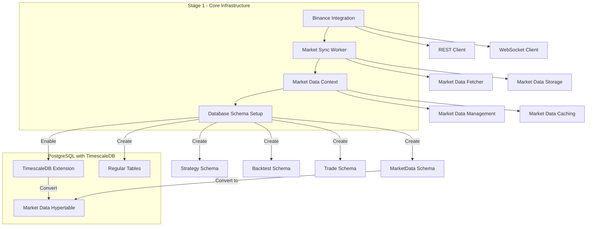

### 4.2 Stage 2: Backtest Engine

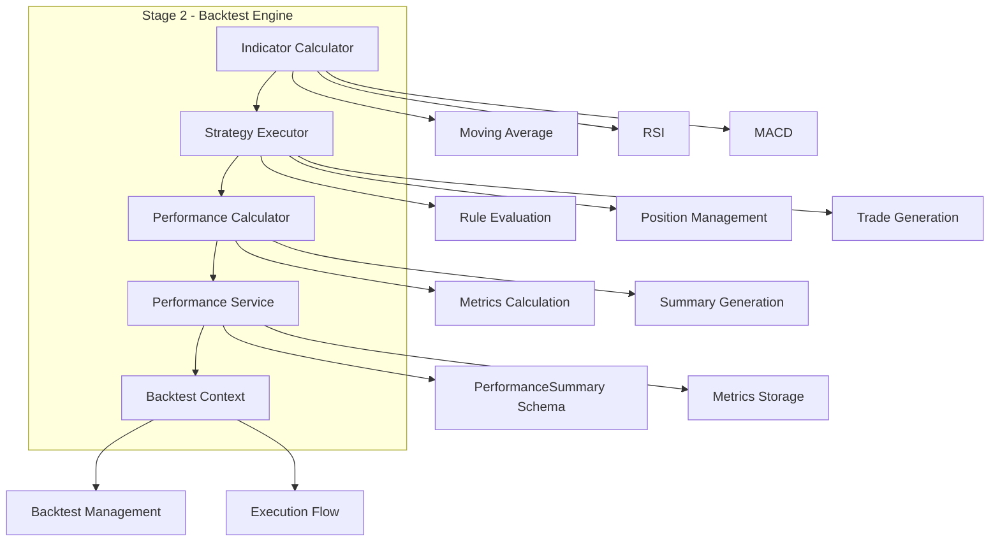

### 4.3 Stage 3: User Interface

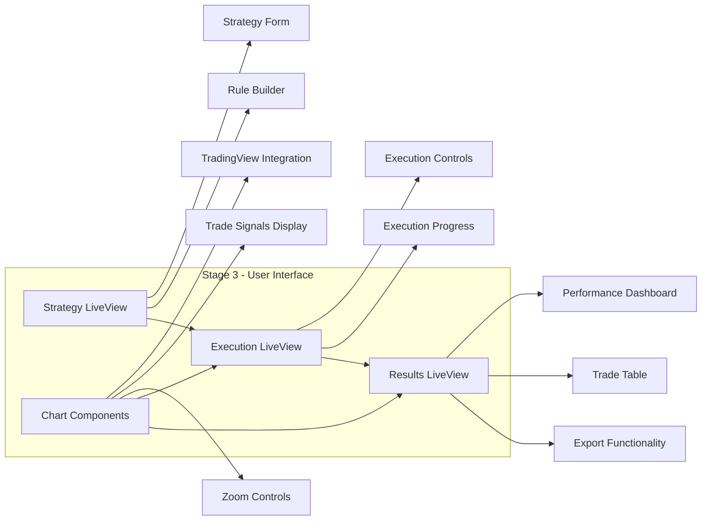

### 4.4 Stage 4: Optimization and Scalability

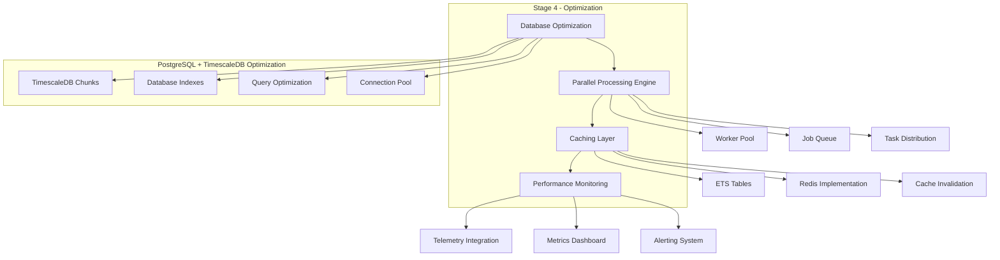

### 4.5 Stage 5: Transaction Replay, Security, and Production

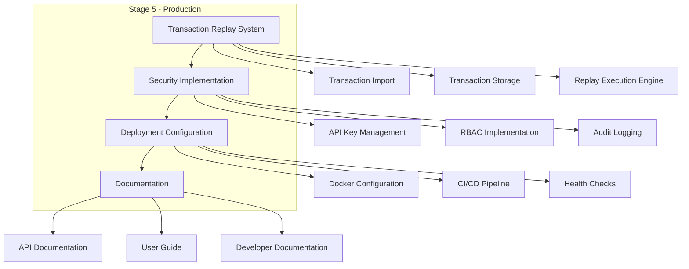

## 5. Complete System Workflow

This diagram illustrates the end-to-end flow of the backtest system.

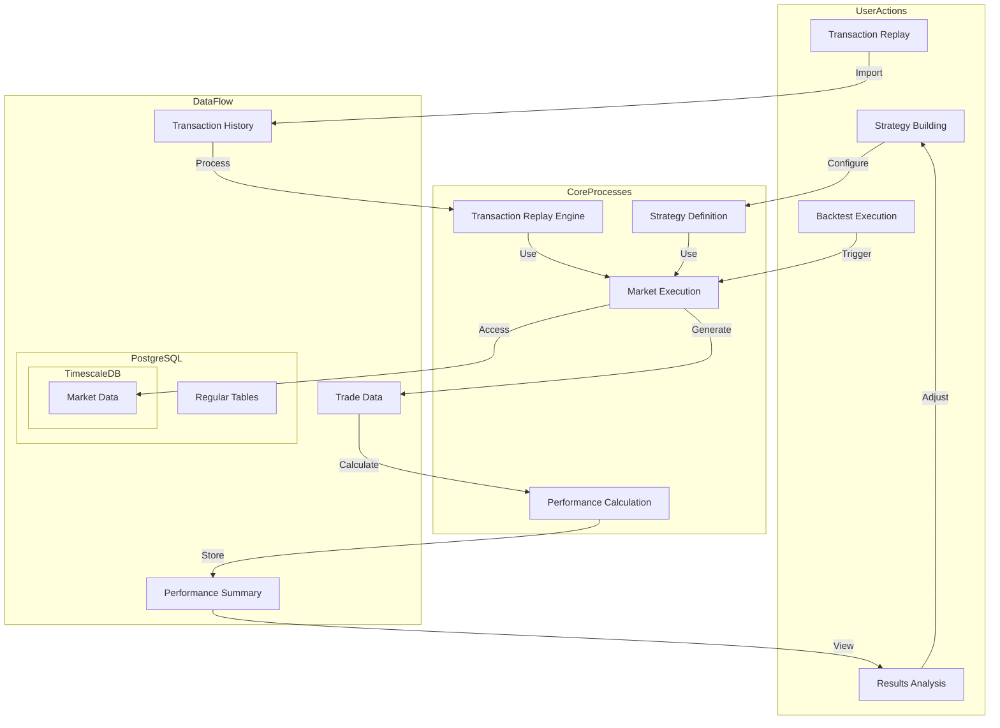

## 6. Database Architecture

This diagram clarifies the relationship between PostgreSQL and TimescaleDB in the system.

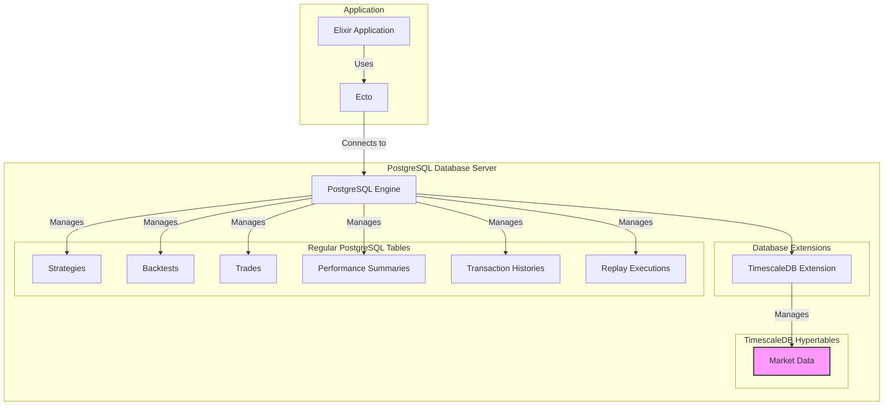

## 7. Component Interaction

This diagram shows how the Phoenix LiveView components interact with the backend contexts.

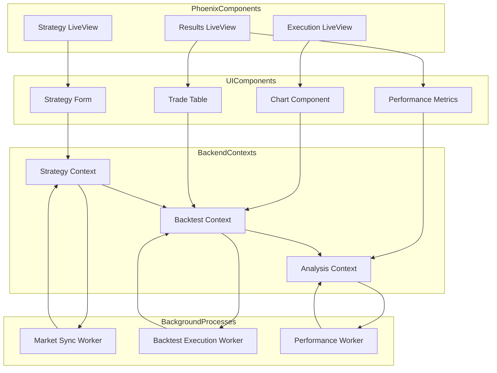

## 8. Security Architecture

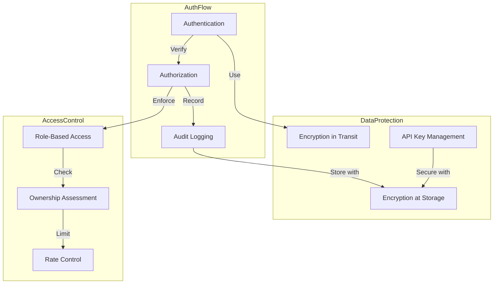

## 9. Performance Optimization Flow

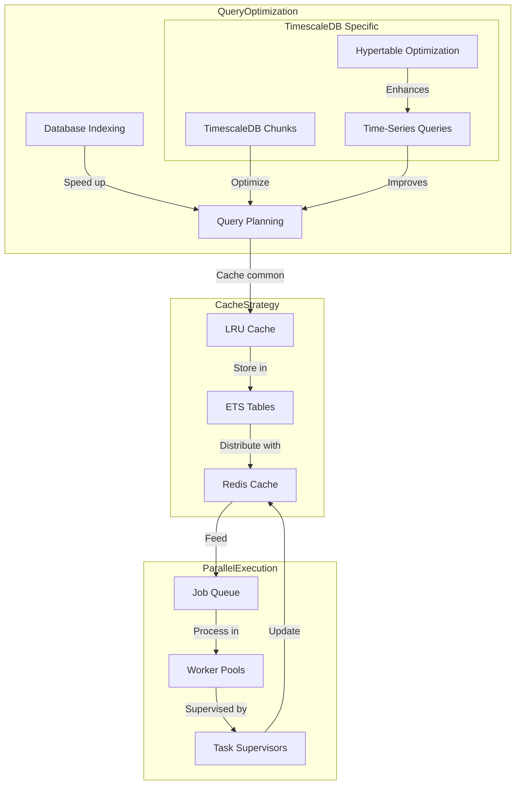

These diagrams represent the key components, workflows and architecture of the backtest system, based on the detailed analysis of the provided documentation. The relationship between PostgreSQL and TimescaleDB is now more clearly illustrated, showing that TimescaleDB is an extension within PostgreSQL rather than a separate database system. 