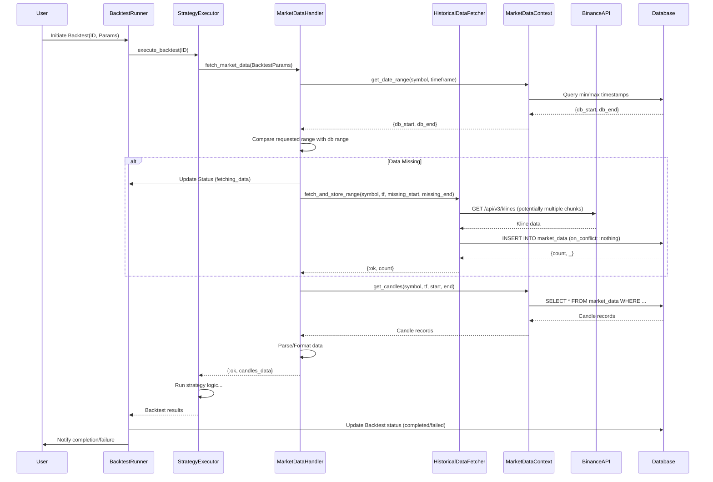

# Backtest Historical Market Data Sync Mechanism

## 1. Problem Statement

Currently, when a user initiates a backtest for a specific time period (`start_time` to `end_time`), the `BacktestRunner` assumes the necessary historical market data (klines/candles) for the requested `symbol` and `timeframe` already exists in the `market_data` database table.

If the data for the requested period (especially older historical data) has not been previously synced by the `MarketSync` worker, the `MarketDataHandler` (used by `StrategyExecutor`) will fetch incomplete or no data. This leads to:

*   Inaccurate backtest results.
*   Potential backtest failures if no data is found at all.
*   Poor user experience, as the reason for failure might not be immediately obvious.

The existing `MarketSync` worker is designed for *ongoing* synchronization, typically fetching data from the last known point up to the present. It does not have a mechanism to perform *targeted* fetches for arbitrary historical ranges requested on demand by a backtest.

## 2. Proposed Solution Overview

Implement a mechanism to detect missing historical data *before* executing the core backtest logic. If data is missing for the requested range, trigger a targeted, blocking fetch operation to retrieve the necessary data from the Binance API (`GET /api/v3/klines`) and store it in the database. Only proceed with the backtest execution once the required data is confirmed to be available.

## 3. Detailed Implementation Proposal

### 3.1. Modify `MarketDataHandler.fetch_market_data/1`

This function is the ideal place to intercept the data request and check for availability.

*   **Input:** `backtest` struct containing `symbol`, `timeframe`, `start_time`, `end_time`.
*   **Steps:**
    1.  **Check Data Range:** Before querying for candles, call `MarketDataContext.get_date_range(backtest.symbol, backtest.timeframe)` to get the earliest (`db_start`) and latest (`db_end`) timestamps currently available in the database for this market.
    2.  **Identify Missing Range:**
        *   If `db_start` is `nil` (no data exists), the entire range from `backtest.start_time` to `backtest.end_time` is missing.
        *   If `backtest.start_time` is earlier than `db_start`, the range from `backtest.start_time` to `DateTime.add(db_start, -1, :second)` (or similar precision adjustment) is missing.
        *   If `backtest.end_time` is later than `db_end`, the range from `DateTime.add(db_end, <timeframe_duration>, :second)` to `backtest.end_time` is missing. (*Note: This scenario is less likely if `MarketSync` is running regularly, but should be handled*).
    3.  **Trigger Fetch (If Missing):**
        *   If any data is missing, log the required range.
        *   Update the backtest status temporarily (e.g., via `BacktestRunner.update_progress` or a direct status update) to `:fetching_data` to provide user feedback.
        *   Call a new function, e.g., `HistoricalDataFetcher.fetch_and_store_range(symbol, timeframe, required_start_time, required_end_time)`. This function should block until the fetch is complete or fails.
        *   **Handle Fetch Result:**
            *   If `fetch_and_store_range` returns `{:ok, count}`, log success and proceed to step 4.
            *   If it returns `{:error, reason}`, log the error, update the backtest status to `:failed` with an appropriate error message (e.g., "Failed to fetch required historical data"), and return `{:error, "Failed to fetch required historical data"}` from `fetch_market_data`.
    4.  **Fetch Candles:** Once any missing data has been successfully fetched (or if no data was missing initially), proceed with the existing `MarketDataContext.get_candles(symbol, timeframe, backtest.start_time, backtest.end_time)` call.
    5.  **Return Data:** Continue with the rest of the function logic (parsing, formatting, returning `{:ok, candles_data}`).

### 3.2. Create `HistoricalDataFetcher` Service

Create a new module, potentially `lib/central/backtest/services/historical_data_fetcher.ex`. This module will encapsulate the logic for fetching specific historical ranges.

*   **Function:** `fetch_and_store_range(symbol, timeframe, start_time, end_time)`
*   **Steps:**
    1.  **Calculate Chunks:** Determine if the requested range (`start_time` to `end_time`) exceeds the Binance API limit for `klines` (e.g., 1000 or 2000 candles per request, depending on the API version/details). If it does, break the request into multiple smaller, sequential time chunks.
    2.  **Iterate and Fetch:** For each chunk:
        *   Call `BinanceClient.download_historical_data(symbol, timeframe, chunk_start_time, chunk_end_time)`.
        *   Implement retries similar to `MarketSync.fetch_with_retries` for robustness.
        *   Handle potential API errors (rate limits, invalid parameters). If an unrecoverable error occurs during chunk fetching, return `{:error, reason}`.
    3.  **Prepare and Store:**
        *   Collect the results from all chunks.
        *   Use the same data preparation logic as in `MarketSync` (e.g., `upsert_market_data`'s internal mapping logic) to convert data types (Decimal, DateTime).
        *   Use `Repo.insert_all(MarketData, prepared_data, on_conflict: :nothing)` to store the data efficiently, avoiding duplicates.
    4.  **Return Result:** If all chunks were fetched and stored successfully, return `{:ok, total_candles_inserted}`. Otherwise, return the previously encountered `{:error, reason}`.

### 3.3. Potential `BinanceClient` Adjustments

*   Ensure `BinanceClient.download_historical_data` correctly handles `startTime` and `endTime` parameters passed to the `/api/v3/klines` endpoint.
*   Consider if the client needs enhancements for handling potential rate limits during intensive historical fetches (though the chunking in `HistoricalDataFetcher` should mitigate this).

### 3.4. Backtest Status and User Feedback

*   Introduce a new backtest status like `:fetching_data` or `:preparing_data`.
*   Modify `BacktestRunner` or ensure `MarketDataHandler` can communicate back to update the backtest status when historical fetching starts and ends (or fails). This provides transparency to the user via the UI.

## 4. Workflow

## 5. Considerations

*   **Error Handling:** Robust error handling is crucial, especially for API calls and database interactions during the historical fetch.
*   **API Limits:** The `HistoricalDataFetcher` must respect Binance's API rate limits and request limits (e.g., max klines per request). Chunking is essential.
*   **Performance:** Fetching large amounts of historical data can be time-consuming. The blocking nature means the backtest won't start until the fetch is done. The `:fetching_data` status helps manage user expectations. Consider potential optimizations or making the fetch asynchronous if the delay is unacceptable (though this adds complexity).
*   **Concurrency:** If multiple backtests request overlapping missing historical data simultaneously, the `on_conflict: :nothing` strategy during insert prevents issues, but multiple fetch requests might still hit the API. A more advanced solution could involve a dedicated queue or locking mechanism in `HistoricalDataFetcher` if this becomes a problem.
*   **`MarketSync` Interaction:** Ensure this new mechanism doesn't conflict with the regular `MarketSync` worker. The `on_conflict: :nothing` approach should make them compatible. 